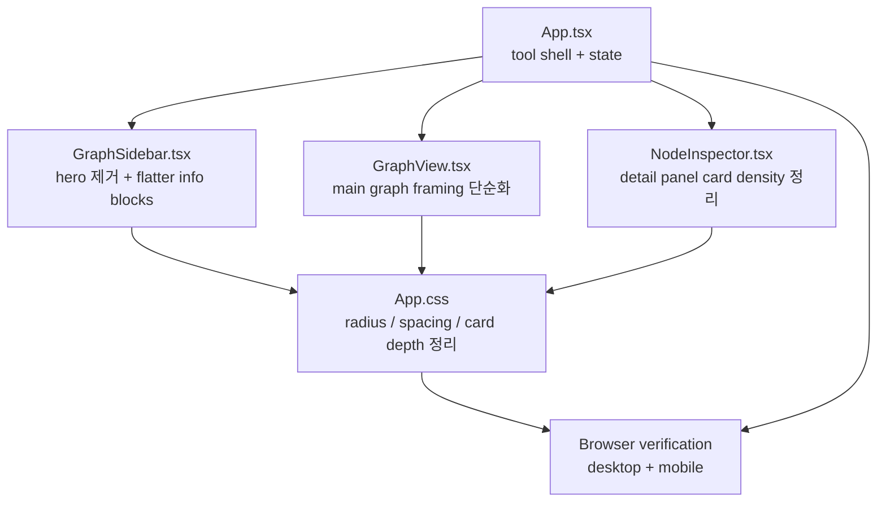

# kg-dashboard UI Rule Alignment Plan

Derived from the current `kg-dashboard/` implementation, package-level verification run on 2026-04-12, and the frontend rule violations confirmed in the current Codex session.

This plan is intentionally separate from `kg-dashboard/plan.md`. The existing plan focuses on graph data ingestion and product capability growth. This document scopes only the UI rule-alignment cleanup requested on 2026-04-12.

The user explicitly asked to bundle these fixes together: hero removal, nested-card cleanup, radius and letter-spacing normalization, and main graph frame simplification. Because the bundled scope is already fixed by the request, this document includes both Phase 1 and Phase 2 in one pass.

---

## Phase 1 — Business Review

### 1.1 문제 정의

**현재 상태**: `kg-dashboard`는 `npm test`, `npm run lint`, `npm run build`, 브라우저 로딩, 콘솔 에러 기준으로는 동작한다. 하지만 실제 UI는 도구 화면인데도 hero 성격의 소개 패널이 먼저 오고, `panel` 안에 `metric-card`/`selection-card`/`hub-summary-card`가 반복되며, radius와 negative letter-spacing이 규칙을 넘고, 메인 그래프가 장식성 카드 프레임 안에 들어가 있어 현재 frontend rule set과 맞지 않는다.

**목표 상태**: 첫 화면이 소개 카드가 아니라 실제 graph tool 구조로 시작하고, 메인 그래프는 기능적 경계만 가진 unframed canvas로 보이며, sidebar와 inspector는 card-in-card 없이 단순한 정보 밀도 구조로 정리되고, radius는 8px 이하로, letter-spacing은 0으로 통일된다.

**영향 범위**: 현재 위반은 주로 5개 파일에 모여 있다.
- `src/App.css`
- `src/App.tsx`
- `src/components/GraphSidebar.tsx`
- `src/components/NodeInspector.tsx`
- `src/components/GraphView.tsx`

검증 기준:
- `npm test`
- `npm run lint`
- `npm run build`
- browser visual spot-check on desktop/mobile

### 1.2 제안 옵션

| 옵션 | 설명 | 공수(일) | 리스크 | 비용(AED) |
|------|------|---------|--------|----------|
| A | CSS 값만 손본다. radius, letter-spacing, shadow만 낮추고 구조는 그대로 둔다. | 0.5 | hero와 nested card 구조가 그대로 남아 규칙 위반이 재발한다 | 0 |
| B | 구조와 스타일을 같이 정리한다. hero를 제거하고, sidebar panel 내부의 card-like repeated blocks를 flatter list/row 구조로 바꾸고, 메인 graph frame도 기능적 경계만 남긴다. | 1.5 | 여러 컴포넌트에 걸쳐 스타일 회귀 확인이 필요하다 | 0 |
| C | 레이아웃 자체를 다시 짠다. graph-first 2-column 도구 화면으로 재구성하고 sidebar/inspector를 모두 다시 설계한다. | 3 | 불필요한 churn이 크고 현재 동작 구조를 흔들 수 있다 | 0 |

### 1.3 추천 & 근거

**옵션 B 추천**: 지금 문제는 단순 스타일 숫자 문제가 아니라 화면 구조와 시각적 위계가 규칙과 어긋난 것이다. CSS만 만지는 옵션 A로는 hero와 nested card 문제를 닫을 수 없고, 옵션 C는 현재 동작하는 tool flow를 과하게 흔든다. 옵션 B가 가장 작은 수정으로 규칙 위반을 실제로 줄인다.

**롤백**: `App.css`, `App.tsx`, `GraphSidebar.tsx`, `NodeInspector.tsx`, `GraphView.tsx`만 순차 커밋 단위로 나누고, visual verification에서 한 단계라도 깨지면 마지막 UI cleanup 커밋부터 되돌린다.

- [x] **Phase 1 승인** (scope fixed by user request on 2026-04-12)

---

## Phase 2 — Engineering Review

### 2.1 Mermaid 다이어그램



### 2.2 파일 변경 목록

| 파일 | 변경 유형 | 설명 |
|------|----------|------|
| `src/App.tsx` | modify | topbar copy와 section structure를 graph-first tool 흐름으로 정리하고, 소개성 문구를 축소한다 |
| `src/components/GraphSidebar.tsx` | modify | `panel--hero` 제거, summary/search/selection 영역 내부의 card-like repeated items를 flatter row/list 구조로 바꾼다 |
| `src/components/NodeInspector.tsx` | modify | details grid와 selection-style blocks를 card-in-card에서 row/list 중심 구조로 단순화한다 |
| `src/components/GraphView.tsx` | modify | graph legend와 canvas shell 경계를 기능적 viewport 수준으로 줄이고 decorative framing을 약화한다 |
| `src/App.css` | modify | radius를 8px 이하로 통일하고, negative letter-spacing 제거, main graph shell/background/shadow 단순화, sidebar repeated item styling을 flatter pattern으로 재작성한다 |
| `README.md` | optional modify | 필요할 때만 기본 Vite 템플릿 문구를 현재 도구 설명으로 짧게 교체한다 |

`create` 파일은 계획하지 않는다. 이번 정리는 기존 컴포넌트와 CSS만 수정한다.

### 2.3 의존성 & 순서

1. **Step 0 — Guardrail freeze**
   - data model, graph utility logic, JSON asset format은 건드리지 않는다.
   - visual cleanup과 tool-first layout 정리에만 집중한다.

2. **Step 1 — Structural cleanup**
   - `GraphSidebar.tsx`에서 hero 제거와 nested-card source를 먼저 줄인다.
   - `NodeInspector.tsx`도 같은 턴에 flatter detail 구조로 맞춘다.

3. **Step 2 — App shell adjustment**
   - `App.tsx`에서 topbar와 stage composition을 tool-first 흐름으로 재배치한다.
   - graph를 소개 뒤에 놓는 인상을 없앤다.

4. **Step 3 — Visual normalization**
   - `App.css`에서 radius, spacing, shadow, negative letter-spacing, graph frame을 한 번에 정리한다.
   - `GraphView.tsx`에서 legend와 canvas shell이 새 CSS 구조와 맞는지 맞춘다.

5. **Step 4 — Verification**
   - `npm test`
   - `npm run lint`
   - `npm run build`
   - browser spot-check: desktop + mobile

### 2.4 테스트 전략

- **단위 테스트**
  - 기존 `src/utils/graph-model.test.ts`는 그대로 유지하고 회귀가 없는지만 본다.
  - 새 로직 테스트는 기본적으로 추가하지 않는다. 이번 작업은 UI 구조 정리가 중심이기 때문이다.

- **통합 검증**
  - `npm test`로 graph helper 회귀 확인
  - `npm run lint`로 TSX/CSS와 event handler 구조 확인
  - `npm run build`로 production bundle 기준 type/build 상태 확인

- **브라우저 검증**
  - desktop viewport: 첫 화면에서 hero-style promo block이 없어졌는지 확인
  - desktop viewport: graph가 decorative card preview처럼 보이지 않는지 확인
  - mobile viewport: text overflow, card nesting, graph clipping이 없는지 확인
  - console error 0건 확인

- **규칙 체크리스트**
  - hero 제거
  - cards inside cards 제거
  - card/button radius 8px 이하
  - negative letter-spacing 제거
  - main graph를 decorative frame에서 해방

### 2.5 리스크 & 완화

| 리스크 | 영역 | 완화 |
|---|---|---|
| hero를 빼면 sidebar 상단이 너무 비어 보일 수 있다 | UX | 소개 카피는 없애지 말고 panel header 수준의 짧은 문장으로 낮춘다 |
| nested card를 걷어내면 정보 밀도가 떨어질 수 있다 | 가독성 | repeated items는 border-separated list/row 패턴으로 유지하고, 숫자 강조만 남긴다 |
| graph frame을 약화하면 canvas 경계가 모호해질 수 있다 | 시각 구조 | shadow를 줄이되, 얇은 border와 legend bar는 남겨 기능 경계를 유지한다 |
| radius를 일괄 축소하면 모바일에서 딱딱해 보일 수 있다 | 디자인 톤 | 6~8px 범위로 통일하고 padding/spacing으로 부드러움을 유지한다 |
| CSS 공통 선택자 수정이 sidebar와 inspector를 같이 흔들 수 있다 | 회귀 | `App.css` 변경 후 browser verification을 desktop/mobile 둘 다 실행한다 |

### 2.6 Validation Gate

Run these before claiming the cleanup is complete:

```powershell
npm test
npm run lint
npm run build
```

Then run a browser spot-check against the dev server and confirm:
- no hero-first intro panel
- no card-in-card visual nesting
- no negative letter-spacing
- graph is not presented as an embedded preview frame
