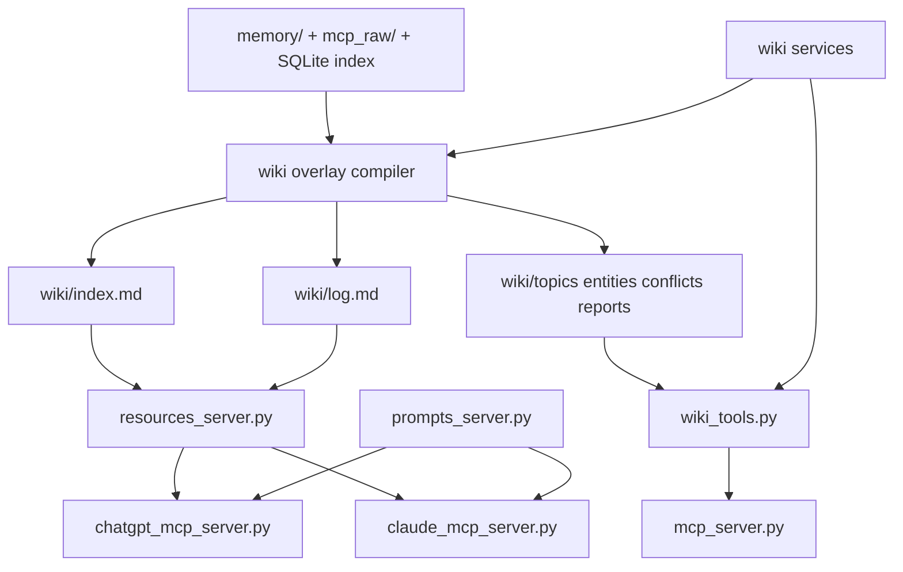

# LLM Wiki MCP Upgrade Plan 2026-04-11

기준:
- `patchupgrade.md`
- 현재 `app/` 및 `app/services/` 파일 구조
- 현재 레포의 memory-first 운영 계약

범위:
- 이번 문서는 `mcp_obsidian`를 `memory CRUD + search 서버`에서 `운영형 LLM Wiki MCP`로 확장하기 위한 승인용 계획이다.
- 구현은 포함하지 않는다.

가정:
- `memory/`는 계속 SSOT(event store)로 유지한다.
- `wiki/`는 새로운 SSOT가 아니라 compiled layer 또는 overlay로 다룬다.
- 기존 specialist route와 wrapper compatibility는 유지한다.
- 현재 세션 확인 결과 `app/` 아래에는 `resources_server.py`, `prompts_server.py`, `task_server.py`, `wiki_tools.py`가 없다.
- 현재 세션 확인 결과 `app/services/` 아래에는 `wiki_store.py`, `wiki_index_service.py`, `wiki_log_service.py`, `conflict_service.py`, `lint_service.py`가 없다.

## Phase 1: Business Review

### 1.1 문제 정의

현재 상태 vs 목표 상태:
현재 `mcp_obsidian`는 이미 `memory CRUD + search + read/write specialist route`를 갖춘 pre-prod 수준 서버지만, MCP 2025-11 운영형 기준에서 필요한 `resources`, `prompts`, `wiki overlay`, `batch tasks/progress`가 빠져 있어 “운영형 LLM Wiki MCP”로는 아직 한 단계 부족하다. 목표 상태는 기존 memory SSOT를 깨지 않고 `wiki overlay + resources + prompts + batch tasks`를 덧붙여 실제 운영형 surface를 완성하는 것이다.

영향 범위:
- 현재 강한 영역: `8개` tools, Markdown SSOT, SQLite derived index, read/write 분리, auth/HMAC
- 신규 운영 계층: `4개` capability 묶음
  - `wiki overlay`
  - `resources`
  - `prompts`
  - `batch tasks/progress`
- 권장 신규 write-side tools: `5개`
  - `sync_wiki_index`
  - `append_wiki_log`
  - `write_wiki_page`
  - `lint_wiki`
  - `reconcile_conflict`
- 권장 초기 batch tasks: `3개`
  - `reindex_memory`
  - `build_wiki_overlay`
  - `lint_full_vault`

### 1.2 제안 옵션

| 옵션 | 설명 | 공수(일) | 리스크 | 비용(AED) |
|------|------|---------|--------|----------|
| A | 현재 구조를 유지하고 문서만 보강한다. `tools 중심 memory server`로 계속 운영한다. | 0.5 ~ 1 | 중간 | 0 |
| B | **권장** `wiki overlay + resources + prompts + wiki-native tools`를 추가한다. `tasks/progress`는 제외한다. | 4 ~ 7 | 낮음 | 0 |
| C | B에 더해 `tasks/progress + full lint + backfill`까지 한 번에 넣는다. | 8 ~ 12 | 중간 | 0 |

### 1.3 추천 & 근거

추천 옵션:
옵션 B 즉시, 옵션 C는 2차

추천 이유:
- 현재 core는 이미 충분히 강해서 갈아엎을 이유가 없다.
- 가장 큰 공백은 `resources/prompts/wiki overlay` surface 부재이지, memory CRUD 자체의 부재가 아니다.
- `tasks/progress`를 같이 넣으면 운영 복잡도가 급격히 올라가므로 2차로 미루는 편이 안전하다.

롤백 전략:
구현 중 문제가 생기면 `resources/prompts`는 read-only route에만 남기고, `wiki-native tools`는 write route에서 비활성화해 기존 `8개 tool` 구조로 즉시 되돌린다.

### 1.4 승인 요청

- [x] Phase 1 승인 (`2026-04-11` 사용자 승인)

## Phase 2: Engineering Review

### 2.1 Mermaid 다이어그램

### 2.2 파일 변경 목록

| 파일 | 변경 유형 | 설명 |
|------|----------|------|
| `app/resources_server.py` | create | `wiki/index`, `wiki/log/recent`, `schema/memory`, `ops/verification/latest`, `ops/routes/profile-matrix` resource surface를 정의한다. |
| `app/prompts_server.py` | create | `ingest_memory_to_wiki`, `reconcile_conflict`, `weekly_lint_report`, `summarize_recent_project_state` prompt surface를 정의한다. |
| `app/wiki_tools.py` | create | write route 전용 `sync_wiki_index`, `append_wiki_log`, `write_wiki_page`, `lint_wiki`, `reconcile_conflict` tool을 노출한다. |
| `app/services/wiki_store.py` | create | `wiki/` overlay 디렉터리 생성, page write/patch, path 보장 로직을 담당한다. |
| `app/services/wiki_index_service.py` | create | `wiki/index.md` materialization과 rebuild entrypoint를 담당한다. |
| `app/services/wiki_log_service.py` | create | append-only `wiki/log.md` 기록과 recent log read helper를 담당한다. |
| `app/services/conflict_service.py` | create | 충돌 claim 병기와 `wiki/conflicts/` 산출물 생성을 담당한다. |
| `app/services/lint_service.py` | create | orphan, stale, missing-evidence, broken-link 탐지와 보고서 생성을 담당한다. |
| `app/mcp_server.py` | modify | main write-capable MCP에서 wiki-native tool 등록과 route surface 결합을 담당한다. |
| `app/chatgpt_mcp_server.py` | modify | ChatGPT read/write specialist route에 resources/prompts와 write-side wiki tool 노출을 분리 반영한다. |
| `app/claude_mcp_server.py` | modify | Claude read/write specialist route에 resources/prompts와 write-side wiki tool 노출을 분리 반영한다. |
| `app/main.py` | modify | overlay 초기화, route mount wiring, capability bootstrap을 연결한다. |
| `app/config.py` | modify | `wiki` overlay root 및 관련 옵션을 읽되 기존 env 계약은 깨지지 않게 확장한다. |
| `tests/` 하위 신규 테스트 파일 | create | resources/prompts/wiki tools의 contract 테스트와 overlay materialization 테스트를 추가한다. |

파일 충돌 확인:
- 현재 세션 확인 결과 `app/resources_server.py`, `app/prompts_server.py`, `app/wiki_tools.py`는 없다.
- 현재 세션 확인 결과 `app/services/wiki_store.py`, `app/services/wiki_index_service.py`, `app/services/wiki_log_service.py`, `app/services/conflict_service.py`, `app/services/lint_service.py`는 없다.
- 따라서 위 `create` 파일명은 현재 워크스페이스와 충돌하지 않는다.

이번 즉시 범위에서 제외:
- `app/task_server.py`
- `tasks/progress` surface
- `path_backfill` batch orchestration 확장
- full vault long-running task orchestration

제외 이유:
- `tasks/progress`는 Option C 2차 범위다.
- 이번 즉시 범위는 `wiki overlay + resources + prompts + wiki-native tools`까지만 포함한다.

### 2.3 의존성 & 순서

1. `wiki overlay` 저장 계약을 먼저 고정한다.
   - `wiki_store.py`
   - `wiki_index_service.py`
   - `wiki_log_service.py`
   - `conflict_service.py`
   - `lint_service.py`

2. 그 다음 read-only surface를 추가한다.
   - `resources_server.py`
   - `prompts_server.py`
   - 이 단계까지는 read profile 강화가 목적이며 mutation은 넣지 않는다.

3. 이후 write-side tool을 추가한다.
   - `wiki_tools.py`
   - `mcp_server.py`
   - `chatgpt_mcp_server.py`
   - `claude_mcp_server.py`

4. 마지막에 app bootstrap과 config를 연결한다.
   - `main.py`
   - `config.py`

병렬 가능 경로:
- 경로 A: `wiki_index_service.py` + `wiki_log_service.py`
- 경로 B: `resources_server.py` + `prompts_server.py`
- 경로 C: `conflict_service.py` + `lint_service.py`

공유 모듈 승인 지점:
- `wiki_store.py`의 overlay write contract가 정해진 뒤에만 `wiki_tools.py`와 route wiring을 붙인다.
- read-only surface(`resources/prompts`)는 write-side tool보다 먼저 고정한다.

### 2.4 테스트 전략

단위 테스트:
- `wiki_store`가 overlay 경로를 보장하는지
- `wiki_index_service`가 `wiki/index.md`를 deterministic하게 materialize하는지
- `wiki_log_service`가 append-only log를 유지하는지
- `conflict_service`가 충돌 claim을 삭제하지 않고 병기하는지
- `lint_service`가 orphan/stale/missing-evidence/broken-link를 분리 리포트하는지

통합 테스트:
- read-only specialist route에서 `resources`와 `prompts`가 discoverable한지
- write-capable route에서 기존 8개 tool이 유지되면서 wiki-native tool이 추가되는지
- `wiki/index.md`, `wiki/log.md`, `wiki/topics/`, `wiki/entities/`, `wiki/conflicts/`, `wiki/reports/` overlay가 실제로 생성되는지

기존 테스트 중 깨질 가능성이 있는 것:
- tool surface 수를 고정 가정하는 specialist route 테스트
- route capability를 tools-only로 가정하는 verification script
- overlay 디렉터리 부재를 전제하는 storage smoke

검증 명령:
- `.venv\\Scripts\\python.exe -m pytest -q`
- `.venv\\Scripts\\python.exe -m ruff check .`
- `.venv\\Scripts\\python.exe -m ruff format --check .`
- targeted MCP verification scripts for chatgpt/claude/main route

### 2.5 리스크 & 완화

성능 리스크:
- every read path가 `wiki/`를 매번 materialize하면 응답이 느려질 수 있다.
- 완화: overlay는 on-write + explicit sync 시 materialize하고, read는 existing artifact를 우선 사용한다.

호환성 리스크:
- specialist route가 `tools only`에서 `resources/prompts`까지 확장되면 기존 클라이언트 문서와 smoke script가 어긋날 수 있다.
- 완화: 기존 tools surface는 유지하고 capability 확장만 추가한다.

데이터 계약 리스크:
- `wiki/`를 editable layer처럼 운영하면 `memory/`와 이중 진실이 생긴다.
- 완화: 문서와 구현 모두에서 `wiki/`를 compiled layer로 정의하고, overwrite보다 regenerate 우선 원칙을 강제한다.

보안 리스크:
- write-capable route에 wiki-native tools를 추가하면 mutation 범위가 넓어진다.
- 완화: read-only route에는 resources/prompts만 넣고, wiki-native tools는 write sibling route에만 제한한다.

범위 리스크:
- `tasks/progress`를 이번 범위에 같이 넣으면 구현과 검증 복잡도가 급증한다.
- 완화: Option C 2차로 분리하고, 이번 즉시 범위는 sync-style tooling까지만 다룬다.

## Coordinator Input Packet

objective:
- 기존 memory SSOT를 유지한 채 `wiki overlay + resources + prompts`를 붙여 운영형 LLM Wiki MCP로 올린다.

non-negotiables:
- `memory/`를 계속 SSOT로 유지
- `wiki/`를 두 번째 진실로 만들지 않음
- 기존 `memory/YYYY/MM` 계약 유지
- 기존 hosted specialist route 유지
- wrapper compatibility 유지

acceptance criteria:
- read-only route에서 `resources`와 `prompts`를 discoverable하게 노출
- write route에서 `wiki-native tools`를 분리 노출
- `wiki/index.md`, `wiki/log.md`, `wiki/topics/`, `wiki/entities/`, `wiki/conflicts/`, `wiki/reports/` overlay 구조가 정해짐
- `tasks/progress`는 이번 즉시 범위에서 제외되고, 2차 계획으로 분리됨

option set:
- Option A: 현행 유지 + 문서 보강
- Option B: resources + prompts + wiki-native tools
- Option C: B + tasks/progress + full lint/backfill

required evidence:
- 현재 `app/` 및 `app/services/` 구조
- 기존 MCP tool surface 문서
- `patchupgrade.md`의 운영형 제안
- 기존 specialist route와 auth boundary 문서

test expectations:
- 이번 단계는 계획 단계라 `manual`
- 구현 단계 진입 전 최소 검증:
  - `.venv\\Scripts\\python.exe -m pytest -q`
  - `.venv\\Scripts\\python.exe -m ruff check .`
  - `.venv\\Scripts\\python.exe -m ruff format --check .`
  - targeted MCP verification scripts

pipeline-coordinator 권고:
- `resources/prompts/wiki tools/tasks`를 한 번에 넣을지, `B 즉시 / C 2차`로 나눌지 다시 점수화가 필요하면 사용
