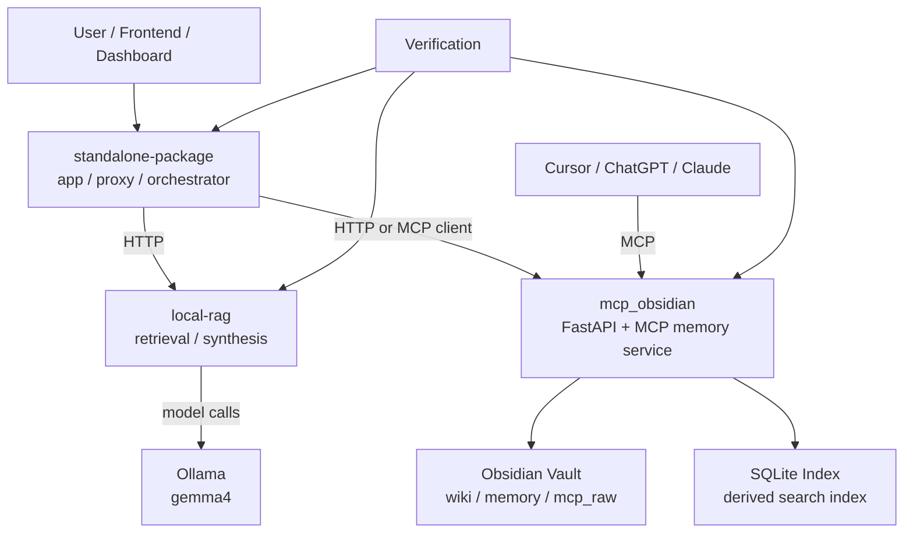

# plan.md

## Phase 1 - CEO Review

### 1.1 Problem Definition

현재 상태는 `One-Page Architecture.md`, `Spec.md`, `Task.md`에 3계층 방향이 정리되어 있지만, 실제 실행 순서와 승인 게이트가 한 장의 `/plan` 형식으로 고정되어 있지 않다. 목표 상태는 `standalone-package`, `mcp_obsidian`, `local-rag`/`Ollama`의 경계, 문서 역할, 실행 순서, 검증 경로를 `plan.md` 한 장에서 바로 승인 가능한 수준으로 고정하는 것이다.

영향 범위:

- 운영 대상 계층 `3개`: app / memory / model
- 로컬 표준 포트 `4개`: `3010`, `8000`, `8010`, `11434`
- 정렬 대상 핵심 문서 `4개`: `One-Page Architecture.md`, `Spec.md`, `Task.md`, `plan.md`
- 후속 구현 영향 저장소 `2개`: `mcp_obsidian`, `standalone-package`

### 1.2 Option Set

| 옵션 | 설명 | 공수(일) | 리스크 | 비용(AED) |
|------|------|---------|--------|----------|
| A | `standalone-package` 안에 knowledge store 성격을 직접 병합 | TBD | 런타임 결합 증가, auth/contract 경계 약화 | TBD |
| B | 3계층 분리 유지, `standalone-package`는 MCP/HTTP client로만 연동 | TBD | 초기 연결 작업 필요, 문서/운영 규약 정렬 필요 | TBD |
| C | 문서만 유지하고 실제 ownership/port/env 정렬을 뒤로 미룸 | TBD | 문서-런타임 드리프트 지속, 승인 후 실행 혼선 | TBD |

### 1.3 Recommendation

추천은 **Option B**다. 앱, durable knowledge store, model engine을 분리하면 저장 일관성과 장애 격리가 가장 좋고, 기존 `mcp_obsidian` 계약도 유지할 수 있다. `standalone-package`에는 클라이언트 연결만 추가하고 SSOT는 계속 Obsidian markdown + SQLite derived index로 두는 것이 가장 단순하다.

롤백 전략: 문서 승인 후 구현 중 문제가 생기면 `standalone-package` 연동만 중단하고 기존 `mcp_obsidian` 단독 운영 구조로 즉시 되돌린다.

### 1.4 Approval Request

- [x] Phase 1 승인
- 승인 범위: 문서상 방향과 책임 경계 확정까지만 포함하며, `/mcp`, auth, tool schema, vault layout 변경은 포함하지 않는다.

## Phase 2 - Engineering Review

사용자 요청에 따라 Phase 1과 Phase 2를 한 문서에 함께 정리한다.

### 2.1 Mermaid Diagram

### 2.2 File Change List

| 파일 | 변경 유형 | 설명 |
|------|----------|------|
| `plan.md` | modify | 본 `/mstack-plan` 형식의 승인용 계획으로 교체 |
| `One-Page Architecture.md` | modify | 운영자 1페이지 요약만 유지하고 세부 계약 제거 |
| `Spec.md` | modify | requirements, success criteria, data flow, resolved decisions의 원본 유지 |
| `Task.md` | modify | `P0` / `P1` / `P2` 우선순위 실행 체크리스트 유지 |
| `..\myagent-copilot-kit\standalone-package\README.md` | modify | knowledge integration boundary와 client-only 연동 원칙 반영 (sibling repo reference) |
| `..\myagent-copilot-kit\standalone-package\.cursor\mcp.json` | verify | `mcp_obsidian` 연결용 project-local MCP 설정을 기준 설정으로 유지 (sibling repo reference) |
| `..\myagent-copilot-kit\standalone-package\.env.local.example` | review | 현재 app/local-rag 기본값 확인용 환경 예시 유지 (sibling repo reference) |
| `..\myagent-copilot-kit\standalone-package\.env.public.example` | review | 공개 배포용 app/local-rag 기본값 확인용 환경 예시 유지 (sibling repo reference) |
| `..\myagent-copilot-kit\standalone-package\docs\INTEGRATION_ARCHITECTURE.md` | verify | standalone 쪽에서 보는 외부 memory/model dependency 문서를 기준 문서로 유지 (sibling repo reference) |

파일명 충돌 체크:

- `plan.md`는 기존 파일을 이번 문서로 교체한다.
- `..\myagent-copilot-kit\standalone-package\.cursor\mcp.json`은 project-local MCP 기준 설정으로 유지한다.
- `.env.local.example`와 `.env.public.example`는 현재 변수명 계약을 바꾸지 않고 참고 기준으로만 유지한다.
- `..\myagent-copilot-kit\standalone-package\docs\INTEGRATION_ARCHITECTURE.md`는 외부 memory/model 경계 기준 문서로 유지한다.

### 2.3 Dependencies and Order

1. 문서 역할을 먼저 고정한다.
   - `One-Page Architecture.md` = summary
   - `Spec.md` = contract
   - `Task.md` = execution single source
   - `plan.md` = approval rationale + sequencing summary

2. 이후 runtime ownership를 확정한다.
   - `standalone-package` = app/proxy/orchestrator
   - `mcp_obsidian` = durable knowledge store
   - `local-rag` / `Ollama` = retrieval/inference engine

3. 그 다음 연결 지점을 구현한다.
   - `standalone-package`는 durable memory가 필요할 때만 `mcp_obsidian`를 bounded external client로 호출
   - `standalone-package`는 `local-rag`를 retrieval/inference 계층으로 호출
   - env/port/health ownership 반영

4. 마지막에 verification path를 묶는다.
   - local health
   - MCP read/write verification
   - local vault visibility
   - cross-repo smoke

병렬 가능 경로:

- 문서 정리는 `mcp_obsidian` 쪽에서 먼저 완료 가능
- `standalone-package`의 `.cursor/mcp.json` 및 env 문서화는 문서 승인 후 병렬 진행 가능
- verification script 정리는 연결 지점이 확정된 뒤에만 진행

공유 모듈 여부:

- `mcp_obsidian`의 MCP contract와 auth 경계는 공유 계약이다.
- 여기 변경이 필요해지면 별도 승인 후 진행한다.

### 2.3.1 Approved Decisions

- `standalone-package`는 durable memory가 실제로 필요할 때만 `mcp_obsidian`를 외부 client로 호출한다.
- production은 app / memory / model을 분리 서비스와 분리 배포 단위로 유지한다.
- `local-rag`와 `Ollama`는 분리 유지한다.

### 2.4 Test Strategy

단위 검증:

- 문서 간 역할 충돌이 없는지 수동 리뷰
- `Task.md` 우선순위와 `Spec.md` success criteria가 추적 가능한지 교차 확인
- `standalone-package` 설정 파일이 `mcp_obsidian` endpoint shape를 잘못 가정하지 않는지 검토

통합 검증:

- `scripts\mcp_local_tool_smoke.py`
- `scripts\verify_mcp_readonly.py`
- `scripts\verify_chatgpt_mcp_readonly.py`
- `scripts\verify_claude_mcp_readonly.py`
- `scripts\run_mcp_verification_round.ps1`
- 필요 시 `scripts\run_upload_pipeline_simulation.ps1`

깨질 수 있는 기존 검증:

- hardcoded title이나 endpoint path를 가정하는 verifier
- `standalone-package` 문서가 단일 프로세스 병합을 전제로 쓴 설명
- `.cursor` project-local MCP config가 없는 상태를 전제한 onboarding 문서

### 2.5 Risks and Mitigations

- 성능 리스크: app이 memory/model 두 계층 모두 동기 호출하면 응답 지연이 커질 수 있다.
  완화: app은 orchestration만 맡기고 heavy retrieval/rerank는 `local-rag` 또는 `mcp_obsidian`에 위임한다.

- 호환성 리스크: `standalone-package`가 `mcp_obsidian` 내부 schema를 직접 가정하면 계약 드리프트가 생긴다.
  완화: MCP tool surface와 documented env/URL만 사용하고 내부 vault layout을 직접 읽지 않는다.

- 보안 리스크: auth가 필요한 `/mcp`와 read-only wrapper 경계를 app 문서에서 혼동할 수 있다.
  완화: write-capable path와 read-only path를 분리 표기하고 token ownership을 env 기준으로만 문서화한다.

## Scope

In scope:

- 3계층 운영 구조 승인
- 문서 역할 분리 고정
- port/env/data flow ownership 고정
- cross-repo integration entrypoint 정의
- verification sequence 정의

Out of scope:

- `standalone-package` 기능 구현
- `mcp_obsidian` MCP schema 변경
- auth middleware 정책 변경
- vault layout 변경
- production deployment 자동화 구현

## Acceptance Criteria

- `plan.md`만 읽어도 추천 옵션, 승인 포인트, sequencing summary가 보인다.
- `One-Page Architecture.md`, `Spec.md`, `Task.md`, `plan.md` 역할이 서로 겹치지 않는다.
- 추천 구조가 `standalone-package` 내 knowledge-store 내장안이 아니라 3계층 분리안임이 명확하다.
- 후속 구현 시 건드릴 파일과 검증 경로가 명시되어 있다.

## Required Evidence

- `One-Page Architecture.md`
- `Spec.md`
- `Task.md`
- 현재 `mcp_obsidian` repo의 MCP verification scripts
- `standalone-package`의 실제 runtime/doc/config 상태

## Test Expectations

- 이번 단계는 문서 계획 단계이므로 verification status는 `manual`
- 구현 단계 진입 전 최소 검증 세트:
  - `.venv\Scripts\python.exe -m pytest -q`
  - `.venv\Scripts\python.exe -m ruff check .`
  - `.venv\Scripts\python.exe -m ruff format --check .`
  - targeted MCP verification scripts

## Next Step

계획이 확정되었습니다. `/review`로 문서 간 충돌 체크리스트를 준비하거나, 바로 문서 정리와 cross-repo integration 설계 반영을 시작할 수 있다.
