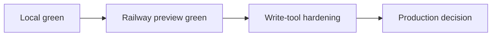

# plan.md



## Objective

이 문서는 `mcp_obsidian`의 다음 작업을 위한 실행 로드맵이다.  
이전의 단순 bootstrap checklist는 더 이상 현재 상태를 반영하지 못하므로, 문서 재검토와 실제 검증 결과를 반영한 **운영 준비 중심 계획**으로 교체한다.

핵심 원칙:

- public contract 유지
- Markdown SSOT 유지
- SQLite derived index 유지
- read-first, write-with-intent 유지
- local-green runtime을 기준으로 움직일 것
- conservative masking policy를 유지한 채 hardening을 확장할 것
- preview deployment를 production 결정보다 먼저 검증할 것

## Recheck Summary

다음 문서를 다시 확인했다.

- `AGENTS.md`
- `CLAUDE.md`
- `README.md`
- `changelog.md`
- `SYSTEM_ARCHITECTURE.md`
- `LAYOUT.md`
- `docs/INSTALL_WINDOWS.md`

문서 재검토 결과:

- 루트 문서 세트는 존재한다.
- 보호 계약 문구는 대체로 정렬되어 있다.
- 기존 `plan.md`의 일부 queue는 이미 완료된 상태다.
- 남은 핵심 과제는 문서화가 아니라 **실제 런타임 준비와 운영 정책 확정**이다.

## Current Verified Baseline

### Completed since the old queue

- markdown write + SQLite upsert path 테스트 존재
- `search` / `fetch` compatibility wrapper 테스트 존재
- root-level docs 세트 존재
- shared schemas 추가
- `obsidian-memory-plugin/` subproject scaffold 추가
- conservative masking policy 구현 + 테스트 추가
- preview-first deployment matrix 문서화 완료
- live read-first MCP verification 완료
- `pytest -q` 통과
- `ruff check .` 통과
- `ruff format --check .` 통과

### Verified current state

- `.env`는 존재한다.
- `mcp` Python dependency는 설치되어 있다.
- Cursor Settings -> MCP에서 `obsidian-memory-local`, `obsidian-memory-production`가 수동 확인됐다.
- current Cursor active config is global:
  - `C:\Users\jichu\.cursor\mcp.json`
- 현재 설정 fallback 기준:
  - `VAULT_PATH=./vault`
  - `INDEX_DB_PATH=./data/memory_index.sqlite3`
  - `TIMEZONE=Asia/Dubai`
  - `MCP_API_TOKEN`은 비어 있지 않다.
- latest live check 결과:
  - `/healthz` -> `200`
  - `/mcp` with auth -> `307`
  - `/mcp/` with auth + event-stream accept -> `400 Missing session ID`
- live read-first MCP verification 결과:
  - `list_recent_memories(limit=5)` 정상 응답
  - `search_memory('E2E hybrid decision')` 정상 응답
  - `search_memory('raw conversation body only')` -> `results: []`
  - wrapper `search` / `fetch` 정상 응답
- live write-once MCP verification 결과:
  - `save_memory` 정상 응답
  - `update_memory` 정상 응답
  - `get_memory` / `search_memory` / `fetch` read-back 정상 응답
  - archived rollback 정상 응답
- live secret-path verification 결과:
  - mixed-secret payload save + masked read-back 정상
  - secret-only payload save reject 정상
  - rejected title searchable state 없음
- hosted specialist route 결과:
  - `/chatgpt-mcp` read-only verification 정상
  - `/claude-mcp` read-only verification 정상
  - `/chatgpt-mcp-write` authenticated specialist write verification 정상
  - `/claude-mcp-write` authenticated specialist write verification 정상

### Interpretation

- 앱은 실제로 기동된다.
- `/mcp` 경로에 인증이 걸려 있는 것은 live로 확인됐다.
- Cursor가 server metadata와 tool offerings를 실제로 읽어온 증거는 있다.
- Cursor UI 기준 `connected`도 확인됐다.
- live read-only MCP flow는 현재 로컬 환경에서 성공했다.

## Locked Contracts

아래는 다음 작업에서도 바꾸지 않는다.

- `/mcp`, `/healthz`
- tool names
  - `search_memory`
  - `save_memory`
  - `get_memory`
  - `list_recent_memories`
  - `update_memory`
  - `search`
  - `fetch`
- compatibility wrapper shape
- Markdown-first architecture
- SQLite derived index only
- relative path `/`
- memory ID pattern `MEM-YYYYMMDD-HHMMSS-XXXXXX`
- current write path `memory/YYYY/MM` and legacy `20_AI_Memory/...` compatibility
- automatic write scope and access control posture

## Remaining Gaps

아직 남아 있는 실제 gap은 다음이다.

1. Railway production path에서는 generated domain이 interim production endpoint로 채택됐다.
2. HMAC phase-2와 memory `p2+` strict sensitivity variant는 구현 및 recheck가 완료됐다.
3. custom domain cutover와 post-cutover token rotation ceremony는 optional hardening queue로 이동했다.

## Parallel Execution Plan

### Lane A - Railway production preparation

목표:
- Railway production path를 preview와 분리된 운영 경로로 고정한다

입력:
- `docs/REMOTE_DEPLOYMENT_MATRIX.md`
- `docs/RAILWAY_PREVIEW_RUNBOOK.md`
- `docs/PRODUCTION_RAILWAY_RUNBOOK.md`
- current Railway preview evidence

작업:
- Railway production project/environment split 정리
- custom domain / token / volume 운영 항목 정리
- rollout checklist 정리

산출:
- Railway production rollout checklist
- Railway production prerequisite list

acceptance criteria:
- Railway production 준비 항목이 문서화됨

### Lane B - Security hardening follow-up

목표:
- privacy-sensitive persistence 정책 이후 hardening queue를 구체화

입력:
- `AGENTS.md` security boundaries
- `app/services/memory_store.py`
- `app/utils/sanitize.py`
- existing tests

작업:
- 현재 conservative policy의 deferred items 정리
- HMAC enforcement 조건 정의
- plugin-side review UX 필요성 평가
- write-tool rollout 이전 추가 테스트 범위 고정

산출:
- hardening backlog
- phase 2 test matrix
- manual review가 필요한 edge case 목록

acceptance criteria:
- deferred items가 queue로 명확히 분리됨
- phase 2 test 범위가 고정됨

### Lane C - Alternate self-managed path

목표:
- VPS path를 alternate self-managed reference로 유지한다

입력:
- `docs/MASKING_POLICY.md`
- `docs/MCP_RUNTIME_EVIDENCE.md`
- current write tools
- sample vault data

작업:
- Railway production 선택 근거 반영
- VPS path를 alternate reference로 낮춤
- self-managed prerequisites 정리

산출:
- alternate path note
- self-managed prerequisite list
- remaining hardening gaps

acceptance criteria:
- Railway production path와 alternate self-managed role이 문서에 고정됨

### Lane D - Plan and docs sync

목표:
- 현재 상태와 앞으로의 작업을 반영하는 최신 `plan.md` 유지

입력:
- `plan.md`
- `README.md`
- `changelog.md`
- `SYSTEM_ARCHITECTURE.md`
- `LAYOUT.md`

작업:
- 이미 끝난 항목은 completed로 이동
- 남은 항목은 runtime / security / deployment / doc-sync로 재편
- verification evidence 형식을 `AGENTS.md`와 맞춤
- docs 간 용어 drift 확인

산출:
- 최신 future roadmap
- parallel lane summary
- acceptance criteria

acceptance criteria:
- `plan.md`가 현재 코드와 문서와 모순 없음
- manual item이 명확히 남아 있음
- blocker 우선순위가 반영됨

## Dependency Rules

- Lane A와 Lane B는 동시에 시작 가능하다.
- Lane C는 Lane A의 preview 결과와 Lane B의 hardening backlog를 받아야 final verification 단계로 간다.
- Lane D는 A / B / C 결과를 받아 최종 계획 문서로 수렴한다.

blocker priority:

1. HMAC backfill strategy for historical unsigned legacy notes is not fixed
2. optional custom domain cutover remains open
3. plugin-side review UX is still deferred

## Detailed Next Queue

### Completed

- [x] Validate markdown write + SQLite upsert path
- [x] Add contract tests for compatibility wrappers `search` and `fetch`
- [x] Recheck root-level docs set
- [x] Confirm automated checks pass
- [x] Create `.env` from `.env.example`
- [x] Add `schemas/` for raw/memory contracts
- [x] Add `obsidian-memory-plugin/` scaffold
- [x] Verify Cursor MCP connected state with local + production profiles
- [x] Define masking policy for save/update flows
- [x] Write masking policy tests
- [x] Produce deployment candidate matrix
- [x] Integrate raw archive flow into read-first end-to-end runtime verification
- [x] Execute preview deployment path
- [x] Verify read-only MCP tools over public HTTPS preview
- [x] Define write-tool live verification gate
- [x] Run write-tool live verification with rollback checklist
- [x] Run live masked/rejected write verification against preview
- [x] Perform backup/restore drill on Railway production volume
- [x] Adopt Railway generated production domain as official interim production endpoint
- [x] Fix HMAC phase-2 contract in docs
- [x] Implement HMAC phase-2 signing and signed-note verification
- [x] Enforce strict `p2+` mixed-secret rejection for memory free-text
- [x] Recheck Railway production with signed memory/raw verification
- [x] Deploy and verify ChatGPT read-only specialist route
- [x] Deploy and verify Claude read-only specialist route
- [x] Deploy and verify authenticated ChatGPT specialist write sibling route
- [x] Deploy and verify authenticated Claude specialist write sibling route

### Next

- [ ] Decide whether to add a custom production domain later
- [ ] Run post-cutover production token rotation ceremony only if custom domain is introduced
- [ ] Define historical unsigned legacy note backfill strategy
- [ ] Decide whether raw archive also needs `p2+` strict variant behavior
- [ ] Decide whether ChatGPT write path should move from bearer-gated sibling route to mixed-auth/OAuth for actual in-conversation app writes

## Commands for Next Operator

environment bootstrap:

```powershell
Copy-Item .env.example .env
```

runtime:

```powershell
powershell -ExecutionPolicy Bypass -File .\scripts\start-mcp-dev.ps1
```

railway preview verification:

```powershell
python scripts\verify_mcp_readonly.py --server-url https://mcp-server-production-1454.up.railway.app/mcp/ --token <TOKEN>
```

checks:

```powershell
pytest -q
ruff check .
ruff format --check .
```

manual runtime probes:

```powershell
Invoke-WebRequest http://127.0.0.1:8000/healthz -UseBasicParsing
Invoke-WebRequest http://127.0.0.1:8000/mcp -Headers @{ Authorization = "Bearer <TOKEN>" } -UseBasicParsing -SkipHttpErrorCheck
```

## Evidence and Reporting Contract

향후 작업 보고는 아래를 반드시 포함한다.

- changed files
- generated files
- commands run
- pass / fail / manual
- one-line result summary
- remaining risks

보고 순서는 `AGENTS.md`를 따른다.

1. Verdict
2. Done
3. Partial
4. Not done
5. Evidence
6. Risks
7. Next action

## Definition of Done for This Roadmap

이 로드맵은 아래 조건이 모두 만족될 때 다음 단계로 넘어갈 수 있다.

- `.env` 기반 local runtime validation 완료
- Cursor MCP connected 확인 완료
- masking policy 구현 및 테스트 완료
- remote deployment candidate matrix 작성 완료
- live read-first MCP verification 완료
- Railway hosted preview deployment 완료
- Railway generated production domain adoption 완료
- HMAC phase-2 implementation and Railway production recheck 완료
- 이후 plan이 current docs / code / contract와 계속 일치
